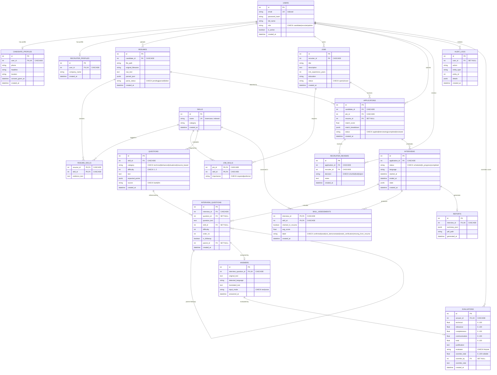

# Database Schema Documentation

This document describes the PostgreSQL database schema for the **Smart Recruitment System**, an AI-powered virtual interview and talent assessment platform.

---

## 1. Table Directory & Purpose

The database comprises 18 tables organized into five core functional domains:
1. **Users & Profiles** (`user.py`): Identity, roles, and candidate/recruiter profiles.
2. **Resumes & Taxonomy** (`resume.py`): Skills taxonomy, resume files, and extracted skill evidence.
3. **Jobs & Applications** (`job.py`): Job openings, skill requirements, candidate applications, and recruiter hiring decisions.
4. **Interviews & Evaluations** (`interview.py`): Question bank, interview sessions, candidate answers, rubric evaluations, skill assessments, and final reports.
5. **Auditing** (`audit.py`): Immutable system audit trail.

### Summary Table

| # | Table Name | Domain | Primary Key | Description & Purpose |
|---|------------|--------|-------------|-----------------------|
| 1 | `users` | Auth/User | `id` (Auto int) | Core authentication entity. Stores email, hashed password, role (`candidate`, `recruiter`, `admin`), activation status, and registration timestamp. |
| 2 | `candidate_profiles` | User | `id` (Auto int) | 1:1 profile extension for candidates with phone, headline, location, and AI/GDPR consent timestamp. |
| 3 | `recruiter_profiles` | User | `id` (Auto int) | 1:1 profile extension for recruiters storing employer company name. |
| 4 | `skills` | Taxonomy | `id` (Auto int) | Standardized taxonomy of technical and soft skills. Skill names are stored in lowercase (e.g. `python`, `sql`) to prevent case duplicates. |
| 5 | `resumes` | Resume | `id` (Auto int) | Candidate uploaded resumes. Tracks file storage path, raw extracted text, AI-parsed JSON structure, and lifecycle status (`pending`, `parsed`, `failed`). |
| 6 | `resume_skills` | Resume | `(resume_id, skill_id)` | Composite M:N link associating a resume to skills extracted by AI, including the specific text snippet evidence. |
| 7 | `jobs` | Job | `id` (Auto int) | Job openings created by recruiters with title, description, minimum experience, education, and status (`open`, `closed`). |
| 8 | `job_skills` | Job | `(job_id, skill_id)` | Composite M:N link defining skills required or preferred for a job posting. |
| 9 | `applications` | Job | `id` (Auto int) | Candidate job application tracking. Enforces unique `(candidate_id, job_id)`, records AI resume-to-job match score, match breakdown JSON, and stage (`applied`, `interviewing`, `completed`, `reviewed`). |
| 10 | `recruiter_reviews` | Job | `id` (Auto int) | Recruiter hiring decision on an application (`shortlist`, `hold`, `reject`) with notes. |
| 11 | `questions` | Interview | `id` (Auto int) | Question bank and AI-generated questions categorized by skill, difficulty (1=Junior, 2=Mid, 3=Senior), question category, expected rubric points JSON, and source (`bank`, `llm`). |
| 12 | `interviews` | Interview | `id` (Auto int) | Virtual interview sessions for an application. Records status (`scheduled`, `in_progress`, `completed`), language, start/end timestamps, and runtime state machine JSON. |
| 13 | `interview_questions` | Interview | `id` (Auto int) | Specific questions asked in an interview. Supports sequential ordering, bank links, and hierarchical followup questions via self-referential `parent_id`. |
| 14 | `answers` | Interview | `id` (Auto int) | Candidate response to an interview question (1:1). Stores original transcript/text, detected language, translated text, and input mode (`text`, `voice`). |
| 15 | `evaluations` | Interview | `id` (Auto int) | Multi-dimensional scoring for an answer (1:1). Scores technical, relevance, completeness, communication, and total (0-100), AI justification narrative, evaluator type (`llm`, `rule`), and human recruiter override fields. |
| 16 | `skill_assessments` | Interview | `(interview_id, skill_id)` | Aggregated proficiency summary per skill evaluated during an interview. Compares resume claims against performance, assigning verified labels (`confirmed`, `weak`, `not_demonstrated`, `needs_verification`, `missing_from_resume`). |
| 17 | `reports` | Interview | `id` (Auto int) | Candidate assessment report for an interview (1:1). Stores structured executive summary JSON and path to downloadable PDF report. |
| 18 | `audit_logs` | Audit | `id` (Auto int) | Immutable compliance log tracking actor user ID, action name, entity type, target entity ID, and event details JSON. Never cascade-deleted. |

---

## 2. Entity-Relationship (ER) Diagram

---

## 3. Key Architectural and Integrity Rules

1. **Cascade Deletions**:
   - Deleting a candidate user cascades to their profile, resumes, submitted applications, and interviews.
   - Deleting a resume cascade-deletes its `resume_skills` records automatically.
   - Foreign keys to resumes on `applications` use `ON DELETE SET NULL`, preserving the application record even if a resume file is purged.
   - **Audit Logs Isolation**: `audit_logs.user_id` is configured with `ON DELETE SET NULL`. Deleting user accounts never deletes audit trails.

2. **Data Consistency and Constraints**:
   - `users.email`: Unique, indexed for fast authentication lookup.
   - `users.role`: Enforced by database CHECK constraint `role IN ('candidate', 'recruiter', 'admin')`.
   - `skills.name`: Case-normalized to lowercase to eliminate redundant taxonomy entries.
   - `applications`: Enforced uniqueness on `(candidate_id, job_id)` via `uq_candidate_job`.
   - `evaluations`: Numeric constraints enforce that all scores (`technical`, `relevance`, `completeness`, `communication`, `total`, `override_total`) are within `0.0` to `100.0`.

3. **Performance Optimization**:
   - All foreign keys are indexed (`index=True`) to prevent sequential scans during JOINs and cascade checks.
   - Composite keys on association tables (`resume_skills`, `job_skills`, `skill_assessments`) ensure fast primary key lookups without artificial surrogate ID overhead.
